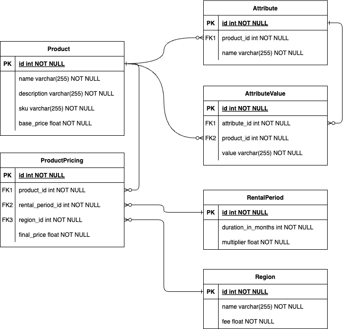

# cinch-tha

## Background
This project serves as my learning documentation in designing a scalable and optimized API.

### Scenario
I want to build an API for a product rental service. The API should allow users to retrieve product details, attributes, rental periods, and regional pricing.

## High-Level Overview

### Database Schema
<p align="center">
<picture>
    <source media="(prefers-color-scheme: dark)"  srcset="docs/assets/erd.dark.png">
    <source media="(prefers-color-scheme: light)" srcset="docs/assets/erd.light.png">
    
</picture>
</p>

**Product**
- Core entity representing rentable items.
- Fields: `name`, `description`, `sku`, `base_price`.

**Attribute**
- Defines characteristics of a product (e.g., Size, Color).
- Linked to Product.
- Each Product can have multiple Attributes.

**AttributeValue**
- Actual values for each attribute (e.g., Size = "44", Color = "Black").
- Linked to both **Attribute** and **Product** (for query flexibility).

**Region**
- Represents the geographic region where a product can be rented.
- Fields: `name`, and `fee` to adjust pricing based on region.

**RentalPeriod**
- Represents rental duration (e.g., 3 months, 6 months, or 12 months).
- Fields: `duration_in_months`, `multiplier` for price scaling.

**ProductPricing**
- Junction table that links **Product**, **Region**, and **RentalPeriod**.
- Stores the final rental price in field `final_price` based on product, region, and rental period.


### Database Migrations

Check in [Migrations](#migrations).

## Setup & Installation

### Disclaimer
⚠️ I tested this setup guide only on macOS Sequoia 15.0.1. If you are using a different OS, you might need to adjust several things.

### Prerequisites

- Homebrew (v4.5.2)
- Python (v3.11)
- MySQL (v9.3.0)

### Steps
#### Environment Setup
1. Create Python venv.
    ```sh
    python -m venv venv
    ```
2. Create `.env` file from [.env.template](.env.template), update the `DATABASE_URL` value if you want to create the database with other name or other driver.
3. Start the MySQL server (I installed the MySQL using `homebrew`).
    ```sh
    brew services start mysql
    ```
4. Check if the server is already started.
    ```sh
    brew services list
    ```
    You will see something like the following if it is already started.
    ```sh
    Name  Status  User           File
    mysql started enchant3dmango ~/Library/LaunchAgents/homebrew.mxcl.mysql.plist
    ```
5. Try to connect to the server.
    ```sh
    mysql -u root
    ```
6. Create `cinch` database and a custom user using the following queries line per line.
    ```sql
    CREATE DATABASE IF NOT EXISTS cinch;
    CREATE USER IF NOT EXISTS 'user'@'localhost' IDENTIFIED BY 'password';
    GRANT ALL PRIVILEGES ON cinch.* TO 'user'@'localhost';
    FLUSH PRIVILEGES;
    ```
7. Try to reconnect to the database with the new user created.
    ```sh
    mysql -u user -p -D cinch
    ```
    Execute the command. Then, input your password. There you go!

#### Migrations
1. Initiate the migration using alembic.
    ```sh
    alembic revision --autogenerate -m "Initial tables"
    ```
2. Apply the migration using alembic.
    ```sh
    alembic upgrade head
    ```
Check the generated tables in your database via database GUI or via CLI.
3. Open the created database, then execute the [populate.sql](populate.sql) query to populate the dummy data.


#### Test the Application
1. Start the application.
    ```sh
    uvicorn app.main:app --reload
    ```
2. Hit the API endpoint `http://127.0.0.1:8000/products/1?attribute_limit=2&pricing_limit=2` or just open it in your browser. If you are using the dummy data. You will get response like the following.
    ```json
    {
        "id": 1,
        "name": "Salomon X Ultra 360",
        "description": "Great hiking shoes.",
        "sku": "X1",
        "base_price": 500000,
        "attributes": [
            {
            "id": 1,
            "name": "Size",
            "values": [
                {
                "id": 2,
                "value": "44.5"
                },
                {
                "id": 1,
                "value": "44"
                }
            ]
            },
            {
            "id": 2,
            "name": "Color",
            "values": [
                {
                "id": 3,
                "value": "Black"
                }
            ]
            }
        ],
        "pricing": [
            {
            "region": "Singapore",
            "rental_period": 3,
            "final_price": 1820000
            },
            {
            "region": "Singapore",
            "rental_period": 6,
            "final_price": 3320000
            }
        ]
    }
    ```
3. Try to filter the product based on the available rental period. Hit the API endpoint `http://127.0.0.1:8000/products?rental_months=3` or just open it in your browser. If you are using the dummy data. You will get response like the following.
    ```json
    [
        {
            "id": 1,
            "name": "Salomon X Ultra 360",
            "description": "Great hiking shoes.",
            "sku": "X1",
            "base_price": 500000,
            "attributes": [
            {
                "id": 2,
                "name": "Color",
                "values": [
                {
                    "id": 3,
                    "value": "Black"
                }
                ]
            },
            {
                "id": 1,
                "name": "Size",
                "values": [
                {
                    "id": 2,
                    "value": "44.5"
                },
                {
                    "id": 1,
                    "value": "44"
                }
                ]
            }
            ],
            "pricing": [
            {
                "region": "Malaysia",
                "rental_period": 3,
                "final_price": 1825000
            },
            {
                "region": "Singapore",
                "rental_period": 3,
                "final_price": 1820000
            }
            ]
        }
    ]
    ```

#### Run the Unit Tests
Just execute the following CLI.
```sh
pytest tests/test_products.py
```
The following is the expected result.
```sh
=============================================================================== test session starts ===============================================================================
platform darwin -- Python 3.11.11, pytest-8.3.5, pluggy-1.6.0
rootdir: /Users/enchant3dmango/Documents/Personal/Repositories/cinch-tha
plugins: anyio-4.9.0
collected 5 items

tests/test_products.py .....                                                                                                                                                [100%]

================================================================================ 5 passed in 0.43s ================================================================================
```

#### Next Iteration
- Add pagination metadata.

Akh, there you go!
